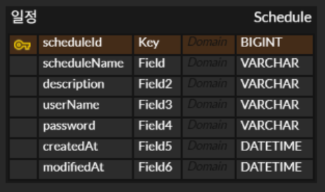
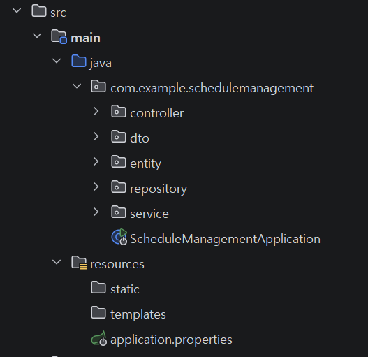
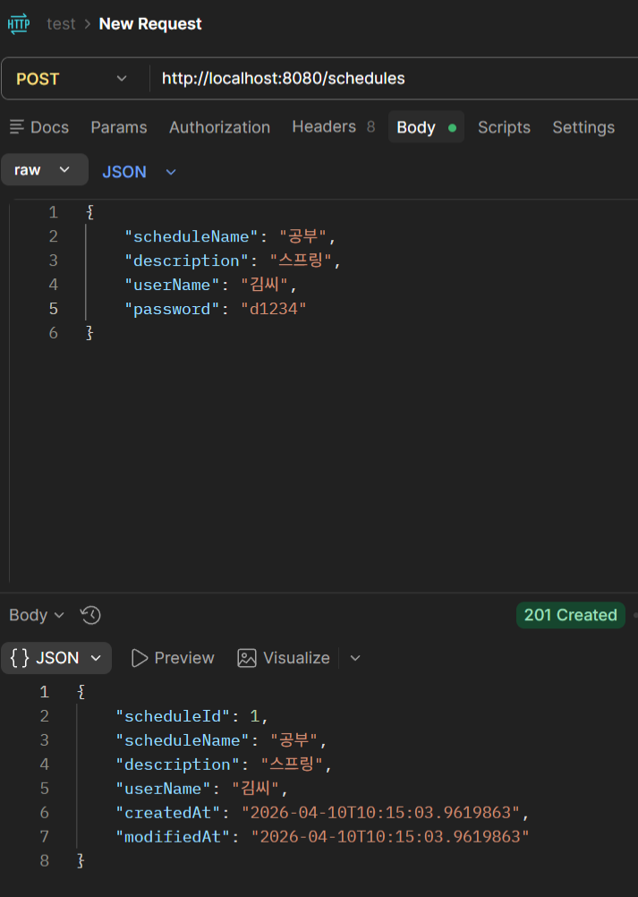
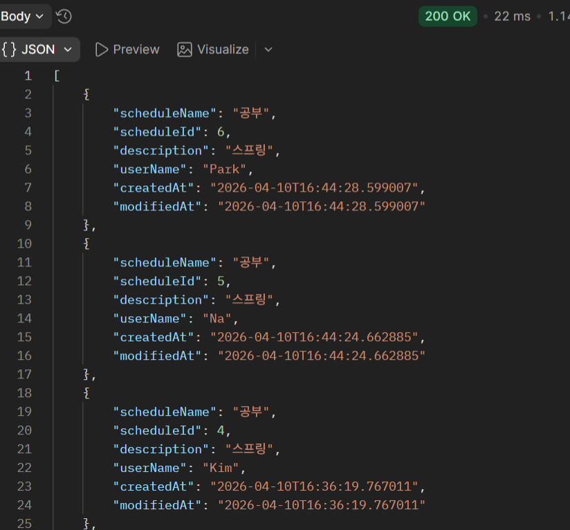
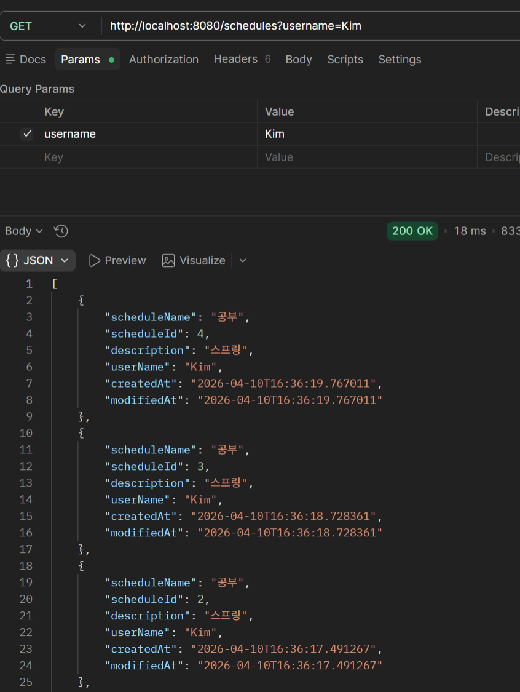
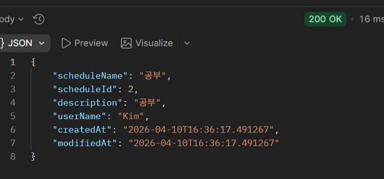
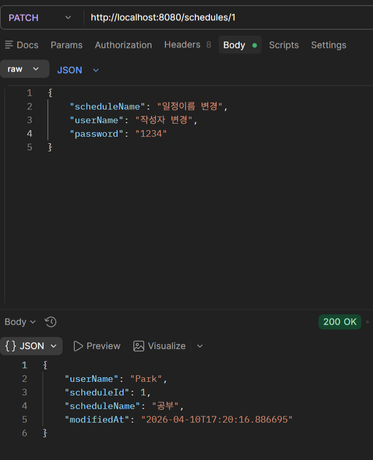
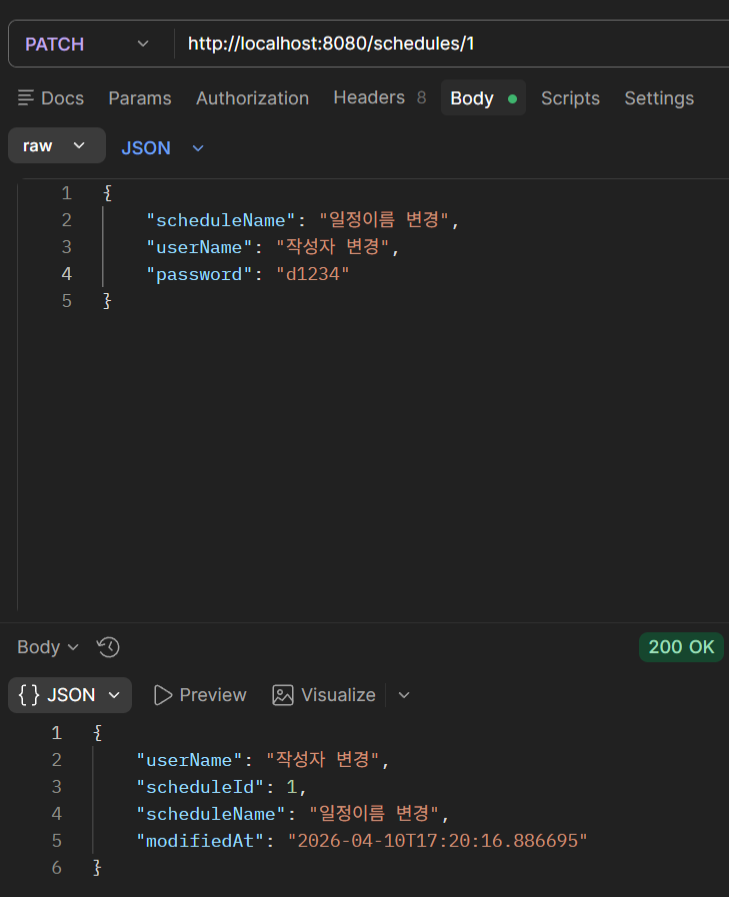
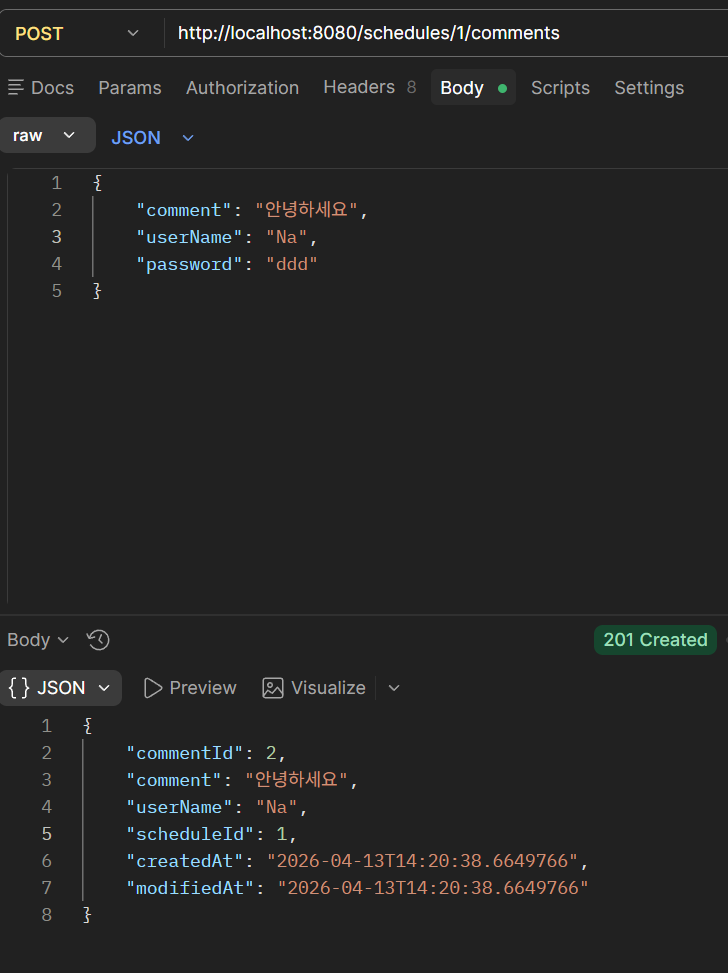
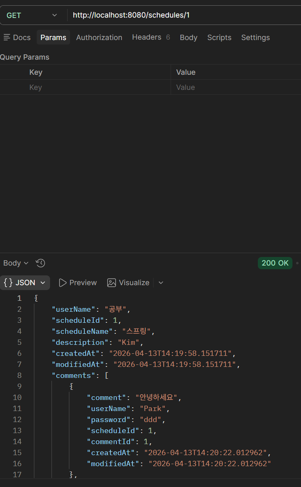

# 일정 관리 앱

## 프로젝트 설명
스프링을 사용해 일정, 댓글 CRUD 구현  
의존성: Lombok, spring Web, mySQL driver, spring data JPA  

## 과제 질문
### 1. 3 Layer Architecture(Controller, Service, Repository)를 적절히 적용했는지 확인해 보고, 왜 이러한 구조가 필요한지 작성해 주세요.  
- 3개의 계층으로 분리하여 개발 최적화, 프로젝트 관리에 용이
- 계층별 변경사항에 영향이 적음  
  유지보수성 up  
  확장성, 재사용성 up  
### 2. `@RequestParam`, `@PathVariable`, `@RequestBody`가 각각 어떤 어노테이션인지, 어떤 특징을 갖고 있는지 작성해 주세요.  
- RequestParam: URL의 ?뒤에 오는 키와 값을 가진 변수를 처리, 정렬과 페이징, 검색에 주로 사용, 민감한 정보는 피하는 것이 좋다.
- PathVariable: URL 경로의 일부를 변수로 받아 사용, {id} 등 단일 객체에 사용
- RequestBody: 요청받은 json 데이터를 자바 객체로 변환하여 사용
## ERD


## API 명세서

일정 생성, 조회, 수정, 삭제 API입니다.

## POST 일정 생성

POST /schedules

일정을 생성합니다.  
POST /schedules

### Request Body

| **이름** | **데이터 타입** | **설명** |
| --- | --- | --- |
| scheduleName | String | 일정 이름 |
| description | String | 일정 내용 |
| userName | String | 작성자 이름 |
| password | String | 수정, 삭제를 위한 비밀번호 |

### Response Body

| **이름** | **데이터 타입** | **설명** |
| --- | --- | --- |
| scheduleId | Long | 일정 식별 id, 응답 시 반환 |
| scheduleName | String | 일정 이름 |
| description | String | 일정 내용 |
| userName | String | 작성자 이름 |
| createdAt | LocalDateTime | 작성일, 자동으로 현재 날짜 저장됨 |
| modifiedAt | LocalDateTime | 수정일, 자동으로 현재 날짜 저장됨(처음 생성 시 작성일과 동일) |

> Body Parameters

```json
{
  "scheduleName": "데이트",
  "description": "여자친구와 데이트",
  "userName": "김민땡",
  "password": "1234"
}
```

> Response Examples

> 201 Response

```json
{
  "scheduleId": 1,
  "scheduleName": "데이트",
  "description": "여자친구와 데이트",
  "userName": "김민땡",
  "createdAt": "2025-04-09T14:30:00.123456",
  "modfiedAt": "2025-04-09T14:30:00.123456"
}
```

> 404 Response

### Responses

|HTTP Status Code |Meaning|Description|Data schema|
|---|---|---|---|
|201|[Created](https://tools.ietf.org/html/rfc7231#section-6.3.2)|none|Inline|
|404|[Not Found](https://tools.ietf.org/html/rfc7231#section-6.5.4)|none|Inline|

## GET 일정 전체 조회

GET /schedules

전체 일정 배열을 조회합니다.

GET /schedules

### ResponseBody

| **이름** | **데이터 타입** | **설명** |
| --- | --- | --- |
| scheduleId | Long | 일정 식별 id, 응답 시 반환 |
| scheduleName | String | 일정 이름 |
| description | String | 일정 내용 |
| userName | String | 작성자 이름 |
| createdAt | LocalDateTime | 작성일 |
| modifiedAt | LocalDateTime | 수정일 |

> Response Examples

> 200 Response

```json
[
  {
    "scheduleId": 1,
    "scheduleName": "데이트",
    "description": "여자친구와 데이트",
    "userName": "김민땡",
    "createdAt": "2025-04-09T14:30:00.123456",
    "modfiedAt": "2025-04-09T14:30:00.123456"
  },
  {
    "scheduleId": 2,
    "scheduleName": "공부",
    "description": "자료 정리",
    "userName": "김만땡",
    "createdAt": "2025-04-09T14:30:00.123456",
    "modfiedAt": "2025-04-09T14:30:00.123456"
  }
]
```

### Responses

|HTTP Status Code |Meaning|Description|Data schema|
|---|---|---|---|
|200|[OK](https://tools.ietf.org/html/rfc7231#section-6.3.1)|none|Inline|

## GET 일정 선택 조회

GET /schedules/2

선택한 일정을 조회합니다.

GET /schedules/{scheduleId}

### Response Body

| **이름** | **데이터 타입** | **설명** |
| --- | --- | --- |
| scheduleId | Long | 일정 식별 id, 응답 시 반환 |
| scheduleName | String | 일정 이름 |
| description | String | 일정 내용 |
| userName | String | 작성자 이름 |
| createdAt | LocalDateTime | 작성일 |
| modifiedAt | LocalDateTime | 수정일 |

> Response Examples

> 200 Response

```json
{
  "scheduleId": 2,
  "scheduleName": "공부",
  "description": "자료 정리",
  "userName": "김만땡",
  "createdAt": "2025-04-09T14:30:00.123456",
  "modfiedAt": "2025-04-09T14:30:00.123456"
}
```

### Responses

|HTTP Status Code |Meaning|Description|Data schema|
|---|---|---|---|
|200|[OK](https://tools.ietf.org/html/rfc7231#section-6.3.1)|none|Inline|

## PATCH 일정 수정

PATCH /schedules/1

선택한 일정의 일정 이름과 작성자를 수정할 수 있습니다.

PUT /schedules/{scheduleId}

### RequestBody

| **이름** | **데이터 타입** | **설명** |
| --- | --- | --- |
| scheduleName | String | 일정 이름 |
| userName | String | 작성자 이름 |
| password | String | 수정, 삭제를 위한 비밀번호 |

### ResponseBody

| **이름** | **데이터 타입** | **설명** |
| --- | --- | --- |
| scheduleId | Long | 일정 식별 id, 응답 시 반환 |
| scheduleName | String | 일정 이름 |
| userName | String | 작성자 이름 |
| modifiedAt | LocalDateTime | 수정일 |

> Body Parameters

```json
{
  "scheduleName": "일정이름 변경",
  "userName": "작성자 변경",
  "password": "1234"
}
```

> Response Examples

> 200 Response

```json
{
  "scheduleId": 1,
  "scheduleName": "일정이름 변경",
  "userName": "작성자 변경",
  "modfiedAt": "2025-04-09T15:35:00.654321"
}
```

### Responses

|HTTP Status Code |Meaning|Description|Data schema|
|---|---|---|---|
|200|[OK](https://tools.ietf.org/html/rfc7231#section-6.3.1)|none|Inline|

## DELETE 일정 삭제

DELETE /schedules/1

선택한 일정을 삭제합니다.

DELETE /schedules/{scheduleId}

### RequestBody

| **이름** | **데이터 타입** | **설명** |
| --- | --- | --- |
| password | String | 수정, 삭제를 위한 비밀번호 |

> Body Parameters

```json
{
  "password": "1234"
}
```
> Response Examples

> 204 Response

### Responses

|HTTP Status Code |Meaning|Description|Data schema|
|---|---|---|---|
|204|[No Content](https://tools.ietf.org/html/rfc7231#section-6.3.5)|none|Inline|

## 프로젝트 구조
Three Layer Architecture


## 기능
- 일정 생성, 수정, 삭제
- 일정 전체 조회(작성자명 기준 조회)
- 일정 선택 조회
- 일정에 댓글 작성(최대 10개 제한)

## 테스트
### 일정 생성


### 일정 조회
전체 조회  
  
  
선택 조회  
  

### 일정 수정
비밀번호 오류시  
  
비밀번호 일치시  
  

### 댓글 생성 및 일정 선택 조회
  
일정 선택 조회 시 댓글 포함  


## 결과
스프링 첫번째 과제

3 Layer Architecture로 프로젝트 구성  
service - controller - repository  

연관관계 매핑, bean Validation 사용하지 않고 일정에 댓글 작성, 컬럼 필수값, 글자 길이 제한을 구현하였습니다.  
service 계층에서 다른 컴포넌트의 하위 계층을 호출했지만, 다음에는 연관관계 매핑으로 대체될 것 같습니다.

